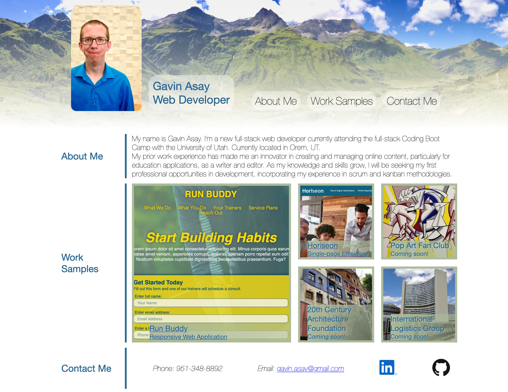

# Gavin Asay's Portfolio

In this first iteration of my portfolio, I used flexbox and CSS grid functionality along with media queries to create a responsive layout.

I look forward to creating a more robust portfolio page with finer details (the hover effect on individual grid items was a strange roadblock).

https://gavin-asay.github.io/ga_portfolio/

https://github.com/gavin-asay/ga_portfolio/tree/main

